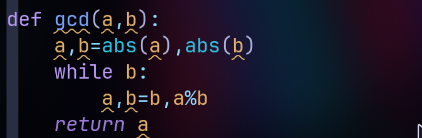

# 密码学知识——代码编写

## 数学工具

### 求最大公因子 gcd() 
  在求最大公因子的时候，存在两点细节，首先是负数的问题，负数和正数的值域相同，所以负数的最大公因子与其相反数的最大公因子相同，所以在gcd的实现中我在刚开始取了绝对值。
  第二点是0的问题。不要陷入0不能做除数的误区，这里最大公因子的定义是能被a或者b整除的数，同时如果两个书都是0,那么他的最小公因子也是0。

  图片中是详细的gcd实现过程在循环中不断地进行求余数，这里实际上不用区分大小，因为python的mod函数是不区分的，不过需要多计算几次。
  算法的终止性：所实现的算法不可能无限循环下去。因为每次 a%b 一定小于 b ，所以b是递减的，那么一定会递减到0。
  部分正确性：循环中的每一步gcd(a,b)都是不变的，同时最后的结果上，b一定是等于0的，而a是最大公因子，因为当b=0的时候，说明上一步的余数为0,说明a所在的值，能够整除。所以这里就是最大公因子处。

### 拓展欧几里得和求模逆
  这里只讲我在实现途中遇到的问题：
  1、我刚开始的时候没有像明白初始值大小之间的关系，我以为必须要有一个大一个小，实际不然，如果刚开始是小的在前面，得到的q是0,然后参数就会互换，然后这样就变得和教科书上一致了。
  2、egcd中为了保证参数更迭正确，最后的计算结果正确，符号不能变动，方便复用，最好是不要在egcd中进行mod处理，而是在modinv中进行处理
  3、modinv中传入的m保证是正数，因为我们是在m的模空间内求逆元，如果m是负数，我们在最后得到结果的时候对正常的m取模就好了。
  补充一下m取整数的原因：1、模5和模-5是同一件事，属于一种等价关系，这和定义相关。2、最大公因子定义上是大于0的，而我们如果在模负数的情况下，通过egcd得到的最大公因子g将会是负数。3、我们在传入的时候就将m变为正数，并且在最后的结果上对真正的m进行取模操作，结果依然不会变

